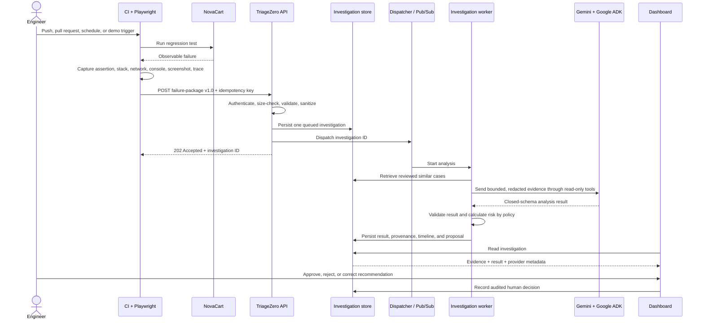

# TriageZero Architecture Overview

## Executive overview

TriageZero is an **autonomous regression-failure investigation platform**. It sits outside the application being tested and converts a raw Playwright failure into a traceable engineering decision: what failed, why it most likely failed, how confident the system is, whether the release should be blocked, and what action a human should approve.

The architecture deliberately separates two systems:

- **NovaCart is the system under test.** It owns the storefront, API, database, controlled defects, Playwright tests, and evidence capture.
- **TriageZero is the investigation control plane.** It owns ingestion, validation, persistence, AI orchestration, safety policy, similarity search, release-risk calculation, audit history, and the engineering dashboard.

This boundary is the most important design decision. TriageZero is not hard-coded into NovaCart and does not need NovaCart's source code or planted-defect labels. Any application capable of producing the versioned failure-package contract can replace NovaCart.

## System architecture

```mermaid
flowchart LR
    subgraph SUT["System under test — replaceable"]
        DEV[Developer change]
        CI[CI test runner]
        PW[Playwright]
        APP[NovaCart web + API]
        DB[(NovaCart PostgreSQL)]

        DEV --> CI --> PW
        PW --> APP --> DB
    end

    subgraph EVIDENCE["Evidence boundary"]
        CAP[Evidence collector]
        PKG[Failure package v1.0]
        ART[(Artifact storage)]

        PW -- failure --> CAP
        CAP --> PKG
        CAP -- screenshots / traces --> ART
    end

    subgraph TZ["TriageZero investigation control plane"]
        API[Ingestion API]
        STORE[(Investigation store)]
        QUEUE[Dispatcher / event queue]
        WORKER[Investigation pipeline]
        SAFE[Redaction + safety boundary]
        RETRIEVE[Reviewed-case retrieval]
        ANALYZER[Analyzer interface]
        RULES[Deterministic analyzer]
        GEMINI[Gemini analyzer]
        ADK[Google ADK workflow]
        POLICY[Deterministic risk policy]
        ACTION[Approval-gated action router]
        UI[Engineering dashboard]

        PKG -- authenticated POST --> API
        API -- validate + deduplicate --> STORE
        API --> QUEUE --> WORKER
        WORKER --> SAFE --> ANALYZER
        WORKER --> RETRIEVE --> ANALYZER
        ANALYZER --> RULES
        ANALYZER --> GEMINI
        ANALYZER --> ADK
        ANALYZER --> POLICY
        POLICY --> STORE
        STORE --> UI
        UI --> ACTION
    end

    ART -. authenticated references .-> WORKER
```



The left side is intentionally replaceable. The right side is the product. Between them is a narrow, versioned contract rather than a shared database or code dependency.

## The end-to-end investigation path



### 1. Detection and evidence capture

Playwright owns detection because it has the most accurate view of the failed user journey. When a test fails, the harness gathers only observable evidence:

- assertion message, expected value, and actual value;
- test identity, retry, browser, branch, and commit;
- failed API calls and normalized response status;
- browser-console errors and a sanitized stack trace;
- screenshot and trace references.

The collector explicitly rejects private QA-oracle data such as the planted scenario name or expected classification. This prevents the demo from “proving” accuracy by giving the answer to the model.

### 2. Contract and ingestion boundary

The producer and consumer communicate through `failure-package` schema version `1.0`. It is a strict, closed contract: unsupported versions, unknown fields, unsafe artifact paths, oversized values, malformed status codes, and forbidden oracle fields are rejected before persistence or model execution.

The producer sends an idempotency key derived from the run and test identity. The API also calculates a canonical package fingerprint. Together these prevent CI retries or concurrent submissions from creating duplicate investigations.

The ingestion endpoint returns `202 Accepted` with an investigation ID. Analysis is not coupled to the HTTP request, which keeps CI responsive and lets workers retry or scale independently.

### 3. Durable investigation lifecycle

An investigation is stored before processing begins and moves through explicit stages:

```text
received → queued → evidence normalized → classified
         → similarity searched → risk assessed
         → recommendation produced → completed / needs review
```

Every transition is appended to a timeline. If processing stops unexpectedly, pending investigations can be recovered instead of silently disappearing. The local milestone uses an in-process dispatcher and a relational store; the production seam replaces the dispatcher with Pub/Sub and uses managed durable storage without changing the API contract or analyzer interface.

### 4. Provider-independent analysis

All analysis providers implement one logical operation:

```text
analyze(failure_package, similar_cases, context) → validated AnalysisResult
```

Three modes sit behind that interface:

- **Deterministic** — an explainable local rule engine requiring no credentials. It is the development default and safe fallback.
- **Direct Gemini** — one structured-output model call for lower-cost integration and comparison.
- **Gemini through Google ADK** — a staged investigation workflow using bounded, read-only tools.

The rest of the platform does not branch on provider. Every provider must return the same closed result schema, including classification, confidence, concise root cause, evidence highlights, responsible component, and recommended next step. The application—not the model—adds provider name, model, prompt version, latency, token usage, fallback reason, and stage status.

### 5. Google ADK workflow

The ADK path is a conservative seven-stage workflow, not an unrestricted swarm:

1. **Evidence normalization** extracts signals from the validated package.
2. **Classification** selects one label from a closed vocabulary.
3. **Root-cause synthesis** states the conclusion without storing hidden reasoning.
4. **Similarity correlation** compares the failure with sanitized, human-reviewed history.
5. **Risk assessment** calls deterministic application policy.
6. **Action construction** proposes one bounded engineering response.
7. **Result validation** rejects anything outside the schema.

The available tools can inspect evidence, retrieve safe historical cases, calculate risk, and validate a result. They cannot run shell commands, read arbitrary files, call arbitrary URLs, modify a database, administer cloud resources, open GitHub issues, access secrets, or read the private evaluation oracle.

### 6. Policy and human-control boundary

The model is allowed to form a diagnosis; it is not allowed to control release policy or execute an external action.

- Severity and release risk are calculated by deterministic code from the validated classification and evidence.
- Generated output is rejected if it contains undeclared fields or invalid enum values.
- Provider failures are recorded honestly. The system either uses a labeled deterministic fallback or marks the investigation `needs_review`.
- Every recommended action starts as `awaiting_approval`.
- Approvals, rejections, and corrected resolutions are append-only audit events.

This turns the AI into a decision-support component inside a governed workflow, rather than an autonomous actor with production privileges.

## Component responsibilities

| Component | Owns | Does not own |
|---|---|---|
| NovaCart | Business UI, API, product/order data, controlled defects | Failure classification or AI logic |
| Playwright harness | Test execution, observable evidence, artifact creation | Expected AI answer or release decision |
| Ingestion API | Authentication, schema validation, sanitization, idempotency, lifecycle API | Long-running model work |
| Dispatcher / queue | Decoupling and delivery of investigation jobs | Analysis policy |
| Investigation worker | Pipeline orchestration, retrieval, provider selection, persistence | Unbounded infrastructure access |
| Analyzer providers | Classification and concise root-cause proposal | Release policy or action execution |
| Risk policy | Severity and release-blocking decision rules | Natural-language diagnosis |
| Investigation store | Evidence metadata, results, provenance, timeline, human decisions | Binary artifact serving |
| Dashboard | Readable investigation view and human decision workflow | Secret storage or duplicate analysis logic |
| Evaluation subsystem | Offline comparison with private ground truth | Input to the analyzer |

## Trust boundaries and security model

TriageZero is designed around two assumptions:

1. **Failure evidence is untrusted input.** Test names, URLs, console text, and stack traces can contain secrets or prompt-injection instructions.
2. **Model output is untrusted output.** A structurally valid response can still be wrong or maliciously influenced.

The controls are therefore structural:

- authenticate producers and dashboard users separately;
- enforce byte limits and a closed request schema at the API edge;
- reject QA-oracle fields recursively;
- redact credential-shaped strings and sensitive URL parameters;
- send only allowlisted, size-bounded evidence to the provider;
- expose read-only ADK tools with no production side effects;
- validate every result against a closed schema;
- calculate release risk outside the model;
- require human approval before any proposed action;
- log identifiers, counts, safe error codes, and provenance—not prompts, raw evidence, secrets, or chain-of-thought.

## Persistence and learning model

The platform does not autonomously train on its own predictions. An unresolved AI result is not treated as truth.

Only a human-reviewed resolution can enter the similarity corpus. On first resolution, TriageZero snapshots the original prediction so later corrections cannot overwrite the scorecard. Subsequent changes create revisions in an audit trail. This produces a controlled learning loop:

```text
prediction → human decision → reviewed resolution → retrieval corpus
           ↘ immutable accuracy comparison ↗
```

Similarity search is currently deterministic and explainable: it weighs repository, test file, endpoint, HTTP status family, error terms, browser, environment, stack component, and expected-versus-actual shape. Each match exposes the signals that caused it. An embedding index can later replace this implementation behind the same retrieval interface.

## Local architecture versus production architecture

| Concern | Local milestone | Production target |
|---|---|---|
| Test execution | Local Playwright or CI runner | Google Cloud CI/CD runner |
| Ingestion | FastAPI on Docker | Authenticated Cloud Run API |
| Dispatch | In-process dispatcher | Pub/Sub |
| Processing | Same API process/background task | Independently scalable Cloud Run worker |
| Metadata store | SQLite / PostgreSQL adapter | Managed PostgreSQL or Firestore, based on query/audit needs |
| Binary artifacts | Relative metadata paths | Cloud Storage with short-lived authorized access |
| AI access | Deterministic, Gemini API, or local ADK | Gemini through Vertex AI and workload identity |
| Dashboard | React/Vite local container | Static Cloud Run service behind user authentication |
| Secrets | Ignored local environment files | Secret Manager and least-privilege service accounts |
| Authentication | Optional local tokens | Separate machine-ingestion and human-dashboard identity |

The migration strategy follows ports and adapters: infrastructure changes at the edges, while the failure contract, investigation domain model, analyzer protocol, policy rules, and dashboard-facing API remain stable.

## Scalability and reliability characteristics

- **Independent scaling:** ingestion remains lightweight while workers scale with investigation volume and model latency.
- **Backpressure:** a queue absorbs bursts from large regression suites instead of overloading the model provider.
- **At-least-once delivery safety:** idempotency keys and unique package fingerprints make redelivery safe.
- **Provider resilience:** bounded timeouts and retries prevent a provider call from hanging the service; labeled fallback preserves availability without falsifying provenance.
- **Recovery:** durable lifecycle state allows queued or interrupted investigations to resume.
- **Cost control:** deterministic mode supports everyday development; direct Gemini supports cheaper integration checks; ADK is reserved for evaluated or production-grade investigations.
- **Observability:** every result records provider, model, prompt/schema versions, latency, tokens, attempts, fallback state, and stage completion.

## Key architecture decisions and tradeoffs

### Separate repositories instead of a monorepo

This preserves the producer/consumer boundary and proves the platform can investigate an external system. The cost is coordinated versioning, handled through the versioned failure-package schema.

### Asynchronous ingestion instead of analyzing inside the POST request

This avoids CI timeouts and lets ingestion and AI processing scale separately. The cost is eventual consistency, handled through an investigation ID, lifecycle states, polling/dashboard updates, and recovery.

### Structured output instead of free-form agent text

This makes results testable, persistable, comparable, and safe to render. The cost is less expressive freedom, which is appropriate for an engineering control plane.

### Deterministic release risk instead of model-owned risk

This makes release gates explainable and resistant to prompt injection. The model can recommend; policy decides.

### Human approval instead of automatic remediation

This prevents a misclassification from creating external side effects. Automatic GitHub issue creation or targeted reruns can be added later as separately authorized adapters without granting the analyzer direct access.

### Reviewed-history retrieval instead of learning from every prediction

This prevents AI errors from reinforcing themselves. The tradeoff is a smaller corpus, but one with much higher trust.

## Current implementation status

Implemented and verified locally:

- NovaCart React/FastAPI/PostgreSQL application and Playwright baseline;
- deterministic controlled-defect scenarios and sanitized failure evidence;
- strict `failure-package` v1.0 submission with idempotency;
- TriageZero React dashboard and FastAPI investigation API;
- durable lifecycle, retry, similarity retrieval, policy, approval, and audit flows;
- deterministic, direct Gemini, and staged Google ADK analyzers behind one interface;
- closed-schema model validation, redaction, prompt-injection controls, bounded retry, and truthful fallback;
- real Google ADK/Gemini analysis verified locally without fallback.

Production integration still to complete:

- deploy the API, worker, and dashboard on Google Cloud;
- replace local dispatch with Pub/Sub;
- upload screenshots and traces to Cloud Storage;
- finalize managed persistence and production identity;
- connect the CI runner to the deployed authenticated ingestion endpoint;
- evaluate multiple failure classes against private ground truth in a full production rehearsal.

## The architecture in one sentence

**TriageZero is a provider-independent, event-driven investigation control plane that accepts untrusted test evidence through a versioned contract, turns it into a policy-governed and auditable diagnosis, and keeps every production-impacting action behind explicit human approval.**

## 60-second presentation script

> TriageZero is not part of the application it tests. NovaCart and its Playwright suite are one replaceable producer; TriageZero is a separate investigation control plane. When Playwright detects a failure, it captures only observable evidence and submits a strict, versioned failure package. The API authenticates, validates, sanitizes, deduplicates, and stores that package, then dispatches an asynchronous investigation so CI never waits on a model. The worker retrieves only human-reviewed similar cases and sends bounded, redacted evidence through a provider-independent analyzer interface. That interface supports deterministic rules, direct Gemini, or a seven-stage Google ADK workflow with read-only tools. Model output must pass a closed schema, while severity and release risk are calculated by deterministic application policy. The result, provider provenance, evidence, fallback state, and timeline are stored for the dashboard. TriageZero may propose an action, but it cannot execute one—the engineer must approve or correct it, and that decision becomes audited history. This is what makes the system reusable, scalable, measurable, and safe enough to sit in a release workflow.
