# TriageZero

**Autonomous failure intelligence for regression testing.**

TriageZero converts a failed Playwright test into a traceable engineering investigation: what failed, the most likely root cause, confidence, severity, release risk, supporting evidence, similar historical failures, and a recommended action that remains under human control.

The project is deployed on Google Cloud and runs autonomously. NovaCart is the controlled application under test; TriageZero is the external investigation platform. They are deliberately separated so the platform can later accept evidence from any application that implements the same versioned failure-package contract.

## Live system

| Resource | Live URL |
|---|---|
| TriageZero dashboard | [triagezero-web-oszu77g5xq-uc.a.run.app](https://triagezero-web-oszu77g5xq-uc.a.run.app) |
| TriageZero backend API | [triagezero-api-oszu77g5xq-uc.a.run.app](https://triagezero-api-oszu77g5xq-uc.a.run.app) |
| API contract | [OpenAPI documentation](https://triagezero-api-oszu77g5xq-uc.a.run.app/docs) |
| API liveness | [`/api/v1/livez`](https://triagezero-api-oszu77g5xq-uc.a.run.app/api/v1/livez) |
| API readiness | [`/api/v1/readyz`](https://triagezero-api-oszu77g5xq-uc.a.run.app/api/v1/readyz) |
| NovaCart application | [novacart-web-oszu77g5xq-uc.a.run.app](https://novacart-web-oszu77g5xq-uc.a.run.app) |
| NovaCart API | [novacart-api-oszu77g5xq-uc.a.run.app](https://novacart-api-oszu77g5xq-uc.a.run.app) |
| TriageZero AI source | [bradhak5-ASU/TriageZero-AI](https://github.com/bradhak5-ASU/TriageZero-AI) |

The TriageZero dashboard requires the configured Firebase demo account. NovaCart is public and requires no login.

## Judge access

Use a dedicated, least-privilege Firebase email/password account for judging. Do not reuse an owner, developer, Google Cloud, or personal account. The email and temporary password must be delivered only through the submission portal's private testing-instructions field; they must never be committed, placed in an issue, or shown in screenshots.

The judge account needs only permission to sign in to the dashboard and exercise the approval/rejection demonstration. It does not need Google Cloud Console, GitHub write, billing, Secret Manager, or deployment access. Before submission, verify the credentials in a fresh private/incognito window with password-manager autofill disabled.

See [JUDGE_TESTING_INSTRUCTIONS.md](JUDGE_TESTING_INSTRUCTIONS.md) for the private handoff copy and [SUBMISSION_FREEZE_CHECKLIST.md](SUBMISSION_FREEZE_CHECKLIST.md) for the final release gate.

## Repositories and disclosure

TriageZero is intentionally split across two public repositories:

| Repository | Public URL | Contents |
|---|---|---|
| NovaCart and evidence producer | [bradhak5-ASU/TriageZero](https://github.com/bradhak5-ASU/TriageZero) | Replaceable application under test, controlled failures, Playwright runner, evidence capture, private evaluation fixtures, and authenticated submission client |
| TriageZero AI platform | [bradhak5-ASU/TriageZero-AI](https://github.com/bradhak5-ASU/TriageZero-AI) | Dashboard, investigation API, persistence, analyzer providers, Google ADK workflow, deterministic policy, authentication, evaluation, and Google Cloud deployment |

Both repositories are required to reproduce the complete local producer-to-investigator workflow. The deployed demo also uses both codebases. No third private source repository is required. Runtime credentials, Firebase configuration, ingestion tokens, Google Cloud identities, and private submission fields are deliberately excluded from source control.

## The problem

Regression suites can detect that a workflow failed, but the expensive part begins afterward. An engineer must inspect assertions, network calls, console messages, stack traces, screenshots, retry behavior, and recent history before deciding:

- whether the application, test, data, dependency, environment, or timing failed;
- whether the release should be blocked;
- who should own the failure;
- what evidence supports the conclusion;
- whether the proposed response is safe.

TriageZero automates that investigation while preserving evidence, provider provenance, deterministic policy, and human approval.

## Architecture

```mermaid
flowchart LR
    subgraph Subject["Replaceable system under test"]
        Scheduler[Cloud Scheduler]
        Runner[Cloud Run Playwright job]
        Web[NovaCart web]
        AppAPI[NovaCart API]
        AppDB[(NovaCart database)]

        Scheduler --> Runner
        Runner --> Web --> AppAPI --> AppDB
    end

    subgraph Contract["Evidence boundary"]
        Capture[Evidence collector]
        Package[Failure package v1.0]

        Runner -- failed test --> Capture --> Package
    end

    subgraph Platform["TriageZero control plane"]
        Ingest[Cloud Run FastAPI service]
        Validate[Authenticate, validate, sanitize, deduplicate]
        Store[(Cloud SQL PostgreSQL)]
        Pipeline[Investigation pipeline]
        Retrieval[Reviewed-case retrieval]
        Analyzer[Provider-independent analyzer]
        ADK[Google ADK]
        Vertex[Vertex AI — Gemini]
        Policy[Deterministic risk policy]
        Dashboard[Cloud Run dashboard]
        Approval[Human approval boundary]

        Package -- authenticated POST --> Ingest
        Ingest --> Validate --> Store
        Validate --> Pipeline
        Pipeline --> Retrieval --> Analyzer
        Pipeline --> Analyzer --> ADK --> Vertex
        Analyzer --> Policy --> Store
        Store --> Dashboard --> Approval
    end
```



The left side is the demonstration subject and can be replaced. The right side is the product. The two systems do not share application code, databases, credentials, or private evaluation answers; they communicate through one narrow, versioned contract.

For the deeper component, trust-boundary, reliability, and scaling rationale, see [ARCHITECTURE_OVERVIEW.md](ARCHITECTURE_OVERVIEW.md).

## End-to-end flow

Every 30 minutes, without a person starting the run:

1. Cloud Scheduler launches the `triagezero-scheduled-tests` Cloud Run job.
2. Playwright drives a real Chromium browser through the deployed NovaCart site.
3. A failed test captures the assertion, expected and actual values, stack trace, failed network calls, console errors, screenshot, and trace.
4. The evidence collector removes secrets and rejects private oracle fields such as the planted defect name or expected classification.
5. The runner submits `failure-package` v1.0 to the TriageZero API with a machine-only token and an idempotency key.
6. The backend authenticates, byte-limits, validates, sanitizes, deduplicates, and durably stores the investigation.
7. The investigation pipeline retrieves only safe, human-reviewed history.
8. Google ADK uses bounded, read-only evidence tools and Gemini through Vertex AI to produce a structured diagnosis.
9. TriageZero validates the model output and calculates severity and release risk through deterministic application policy.
10. The result, evidence, timing, model/provider metadata, token usage, fallback state, and audit timeline appear in the dashboard.
11. A human can approve, reject, or correct the recommendation. TriageZero does not silently execute it.

A second scheduled job, `novacart-seed`, restores inventory at `:25` and `:55`, shortly before the regression job runs.

## Deployed Google Cloud architecture

| Google Cloud product | Project role |
|---|---|
| Cloud Run services | Host the TriageZero dashboard/API and NovaCart web/API. |
| Cloud Run jobs | Run Playwright regressions and restore NovaCart test data. |
| Vertex AI | Serves Gemini to the ADK agent through service-account credentials. |
| Cloud SQL | PostgreSQL 16 durable persistence for investigations and NovaCart data. |
| Cloud Scheduler | Starts the regression and restock jobs automatically. |
| Google ADK | Orchestrates the staged evidence investigation with read-only tools. |
| Cloud Logging | Stores structured service, ADK, provider, and investigation events. |
| Firebase Authentication | Authenticates human dashboard users. |
| Secret Manager | Holds separately scoped machine and dashboard credentials. |
| Artifact Registry | Stores the deployed container images. |
| Cloud Build | Runs quality gates, builds images, and deploys passing revisions. |

Cloud SQL uses one cost-controlled PostgreSQL instance with separate `triagezero` and `novacartdb` databases, users, and service identities. Isolation is enforced by credentials while avoiding the cost of a second database instance.

## Evidence that the backend is running on Google Cloud

The evidence is not merely that the application opens in a browser. The proof is a chain connecting the public service, its live Cloud Run revision, its readiness probe, and its Vertex AI execution logs.

### Live verification snapshot

Verified on **August 30, 2026 in America/Phoenix** (**August 31 UTC**) against Google Cloud project `triagezero`, region `us-central1`:

| Cloud Run workload | Type | Live revision / execution | Google-reported status |
|---|---|---|---|
| `triagezero-api` | Service | `triagezero-api-00013-fjt` | Ready: `True` |
| `triagezero-web` | Service | `triagezero-web-00008-82k` | Ready: `True` |
| `novacart-api` | Service | `novacart-api-00007-zbd` | Ready: `True` |
| `novacart-web` | Service | `novacart-web-00002-sxx` | Ready: `True` |
| `triagezero-scheduled-tests` | Job | `triagezero-scheduled-tests-plxcs` | Ready: `True` |
| `novacart-seed` | Job | `novacart-seed-jzvxw` | Ready: `True` |

The backend endpoints returned:

```text
GET https://triagezero-api-oszu77g5xq-uc.a.run.app/api/v1/livez
HTTP 200  {"status":"alive"}

GET https://triagezero-api-oszu77g5xq-uc.a.run.app/api/v1/readyz
HTTP 200  {"status":"ready"}
```

`alive` proves the deployed process is serving requests. `ready` additionally checks that the durable datastore is reachable and migrated. The responses were served by `Google Frontend` and included Google Cloud trace identifiers.

Cloud Logging tied the same ready revision to the live AI backend. Recent entries from `triagezero-api-00013-fjt` included:

```text
Sending out request, model: gemini-3.6-flash,
backend: GoogleLLMVariant.VERTEX_AI, stream: False

adk analysis complete
input_tokens: 21236
output_tokens: 2207
```

The log resource identifies:

```text
project_id: triagezero
location: us-central1
service_name: triagezero-api
revision_name: triagezero-api-00013-fjt
resource_type: cloud_run_revision
```

This proves that the deployed Cloud Run backend—not a laptop process—sent Gemini requests through Vertex AI and completed ADK analysis.

### What to show judges

Use this order so every screen proves the next part of the claim:

1. **Open the live dashboard URL.** Point out the `.a.run.app` hostname and a completed investigation.
2. **Open Google Cloud Console → Cloud Run → `triagezero-api`.** Show project `triagezero`, region `us-central1`, green service status, URL, and ready revision `triagezero-api-00013-fjt`.
3. **Open the backend readiness URL.** Show HTTP success and `{"status":"ready"}`. Explain that readiness touches the durable database; it is stronger than a static webpage.
4. **Open Cloud Logging for `triagezero-api`.** Filter to the current revision and show `GoogleLLMVariant.VERTEX_AI`, `gemini-3.6-flash`, and `adk analysis complete` with token counts.
5. **Open the investigation in TriageZero.** Match its provider metadata, ADK stages, timestamps, result, and fallback state to the cloud log window.
6. **Open Cloud Run Jobs.** Show `triagezero-scheduled-tests` and its latest successful execution to prove the failure originated from autonomous cloud automation.

Useful console pages:

- [Cloud Run — `triagezero-api`](https://console.cloud.google.com/run/detail/us-central1/triagezero-api/metrics?project=triagezero)
- [Cloud Run workloads](https://console.cloud.google.com/run?project=triagezero)
- [Cloud Logging](https://console.cloud.google.com/logs/query?project=triagezero)
- [Vertex AI](https://console.cloud.google.com/vertex-ai?project=triagezero)

Cloud Logging query:

```text
resource.type="cloud_run_revision"
resource.labels.service_name="triagezero-api"
resource.labels.revision_name="triagezero-api-00013-fjt"
(jsonPayload.message:"VERTEX_AI" OR jsonPayload.message="adk analysis complete")
```

### Evidence strength

| Evidence | What it proves | Strength |
|---|---|---|
| Screenshot of the dashboard | The UI rendered somewhere. | Weak by itself |
| Public `.run.app` API URL | A Google-hosted Cloud Run endpoint responds. | Good |
| Cloud Run console with ready revision | The backend container is deployed and healthy in the project. | Strong |
| `/livez` and `/readyz` returning 200 | The process and durable datastore are operational. | Strong |
| Vertex request and ADK completion logs on the same revision | The deployed backend executed the required Google AI path. | Strongest |
| Successful scheduled Cloud Run job plus resulting investigation | The complete workflow runs autonomously in Google Cloud. | Strongest end-to-end proof |

Do not use source code, Docker files, a deployment plan, or a local terminal alone as proof of deployment. Those show deployability, not a running Google Cloud backend.

## Judge-ready talking points

### 60-second version

> TriageZero is an autonomous regression-failure investigation platform, not a chatbot. NovaCart is a replaceable system under test, while TriageZero is a separate control plane. Every 30 minutes, Cloud Scheduler launches a Playwright job on Cloud Run against the deployed shop. When a test fails, the runner captures observable evidence and submits a strict, sanitized failure package to the TriageZero backend. The backend is running as the `triagezero-api` Cloud Run service, persists investigations in Cloud SQL, and invokes Gemini through Google ADK and Vertex AI. The agent only receives bounded evidence and read-only tools. Its result must pass a closed schema, while severity and release risk are calculated by deterministic policy. The dashboard shows the diagnosis, evidence, confidence, provider provenance, token usage, fallback state, and audit history. TriageZero can recommend an action, but a human must approve it. We can prove the cloud path with the live `.run.app` URL, the ready Cloud Run revision, the readiness endpoint, and logs from that same revision showing Vertex AI requests followed by completed ADK analyses.

### Architecture talking points

- **Separation:** NovaCart produces evidence; TriageZero investigates it. The platform is not coupled to NovaCart's code or database.
- **Contract:** A strict `failure-package` v1.0 schema is the only integration boundary, making the system reusable for other applications.
- **Lifecycle separation:** The Cloud Run test job submits a durable investigation and receives an investigation ID; the dashboard follows the stored lifecycle instead of holding the test runner open. The dispatcher interface is the seam for a separately scalable queue/worker deployment later.
- **Provider abstraction:** Deterministic rules, direct Gemini, and Google ADK return one validated result type, so provider failure does not break ingestion.
- **Agent design:** ADK is a staged workflow with read-only evidence tools, not an unrestricted autonomous swarm.
- **Policy boundary:** The model proposes a diagnosis; deterministic code owns release risk, and humans own external actions.
- **Truthful fallback:** A failed provider call is labeled as deterministic fallback or `needs_review`; the dashboard never credits ADK for output it did not produce.
- **Durability:** Cloud SQL preserves investigations across container replacement and deployment.
- **Auditability:** Every investigation records evidence, result, provider, model, prompt/schema versions, latency, tokens, attempts, fallback reason, and human decisions.
- **Autonomy:** Cloud Scheduler and Cloud Run jobs create real investigations without manual file upload or a person pressing Run.

### “What is innovative?”

> The innovation is not simply sending a test error to Gemini. TriageZero creates a governed evidence pipeline around the model. It separates the test producer from the investigator, prevents private answers from leaking into evidence, constrains ADK to read-only tools, validates generated output, keeps release policy deterministic, records exact provider provenance, and requires approval before any external action. That makes the result measurable and operationally credible rather than just persuasive text.

### “How do you know the AI was not given the answer?”

> The Playwright evidence builder recursively rejects private fields such as the controlled defect name, expected classification, expected severity, and oracle metadata. The analyzer receives only observable signals: assertions, HTTP statuses, console errors, stack traces, and artifact references. Evaluation joins the prediction to private ground truth only after analysis, outside the model boundary.

### “Why is this safe?”

> Both sides of the AI boundary are treated as untrusted. Evidence is authenticated, size-limited, schema-validated, redacted, and bounded before reaching the model. ADK receives no shell, arbitrary network, filesystem, secret, database-write, GitHub, or cloud-administration tool. Generated output is schema-validated, release risk is calculated outside the model, and every recommended action requires human approval.

### “How do you prove it is really on Google Cloud?”

> I can show the live `.run.app` backend, its green Cloud Run service and ready revision in project `triagezero`, a 200 response from `/readyz`, and Cloud Logging from that exact revision. The logs name `gemini-3.6-flash`, `GoogleLLMVariant.VERTEX_AI`, and completed ADK analyses with token counts. I can then show the scheduled Cloud Run job and the resulting investigation in the dashboard. That connects infrastructure, runtime, AI provider, and product result in one evidence chain.

## AI workflow and safety controls

The Google ADK workflow has seven bounded stages:

1. Evidence normalization
2. Classification from a closed vocabulary
3. Root-cause synthesis
4. Similarity correlation
5. Deterministic risk assessment
6. Approval-gated action construction
7. Closed-schema result validation

The available tools can inspect validated network, console, and failure evidence; retrieve sanitized reviewed cases; calculate risk; and validate the result. They cannot execute shell commands, access arbitrary files or URLs, read secrets, modify cloud resources, write to GitHub, or access the private evaluation oracle.

## Accuracy claim and its limit

The recorded production evaluation scored **84 of 84 externally labelled failures correctly**, including **80 of 80 Google ADK investigations**, with mean confidence `0.941` and no disagreements.

The ground-truth label came from a browser-observed server HTTP 5xx that existed independently of the analyzer. Twenty-eight ambiguous catalogue-exhaustion cases were excluded instead of assigning a convenient label.

This is honest but narrow evidence: it validates one defect class across 84 deployed failures. It does not establish 100% accuracy across the full eight-class vocabulary. Additional controlled defect families are required for broader accuracy claims.

## Component ownership

| Component | Responsibility |
|---|---|
| NovaCart frontend/API | Replaceable application under test and controlled failures |
| Playwright harness | Test execution, observable evidence, screenshots, traces, submission |
| TriageZero API | Authentication, schema enforcement, sanitization, idempotency, lifecycle |
| Investigation pipeline | Retrieval, analyzer orchestration, policy, persistence, recovery |
| Google ADK + Vertex AI | Structured diagnosis using bounded read-only evidence tools |
| Deterministic risk policy | Severity and release-blocking decision |
| Cloud SQL | Durable evidence, results, provenance, timelines, human decisions |
| Dashboard | Investigation visibility and approval/rejection workflow |
| Evaluation subsystem | Offline comparison with private ground truth, never analyzer input |

## Complete local spin-up

The credential-free path uses Docker for both applications and the deterministic analyzer. It is the recommended clean-machine verification because it does not consume Gemini/Vertex quota.

### Prerequisites

- Git
- Docker Desktop with Compose v2
- Node.js 22 and npm, needed only to run Playwright from the host
- Enough local capacity to run two Docker Compose projects and Chromium

### 1. Clone both repositories side by side

```bash
git clone https://github.com/bradhak5-ASU/TriageZero.git
git clone https://github.com/bradhak5-ASU/TriageZero-AI.git
```

Expected layout:

```text
parent-directory/
├── TriageZero/       NovaCart and Playwright producer
└── TriageZero-AI/    investigation platform
```

### 2. Start and seed NovaCart

```bash
cd TriageZero
cp .env.example .env
docker compose up --build -d
docker compose exec backend python -m scripts.seed
docker compose ps
```

Verify `http://localhost:5173` and `http://localhost:8000/api/v1/health`. The API response should be `{"status":"ok"}`. Seeding is idempotent and is required on a fresh database before the catalogue tests run.

### 3. Start TriageZero in deterministic mode

In a second terminal:

```bash
cd TriageZero-AI
docker compose up --build -d
docker compose ps
```

Verify the dashboard at `http://localhost:5174`, the API at `http://localhost:8001/api/v1/health`, and the API docs at `http://localhost:8001/docs`. The committed Compose configuration uses the real local API, open local demo access, durable SQLite, and the credential-free deterministic analyzer.

### 4. Install and run Playwright

In a third terminal:

```bash
cd TriageZero/playwright-tests
npm ci
npx playwright install chromium
npm run test:safeguards
TRIAGEZERO_API_URL=http://localhost:8001 npm test
```

The clean baseline should pass. Failed controlled scenarios create local screenshot/trace evidence and submit a sanitized failure package when `TRIAGEZERO_API_URL` is set. If the AI backend is configured with `API_AUTH_REQUIRED=true`, also supply `TRIAGEZERO_API_TOKEN` through the shell or CI secret store—never in source, evidence, or a committed `.env`.

### 5. Stop without deleting local data

Run `docker compose down` once in each repository. Do not add `--volumes` unless you intentionally want to delete the local PostgreSQL and SQLite data.

Production Firebase/Vertex configuration is not required for local reproduction. The live deployment uses separately managed Google Cloud and Firebase credentials that are not disclosed in either repository.

## Repository layout

```text
TriageZero/
├── frontend/                 NovaCart React/Vite storefront
├── backend/                  NovaCart FastAPI/SQLAlchemy API
├── playwright-tests/
│   ├── tests/                baseline and controlled scenario probes
│   ├── helpers/              evidence builder and TriageZero client
│   ├── safeguards/           oracle-leak and submission protections
│   └── evaluation/           private expected results, never submitted
├── infra/postgres/           local PostgreSQL configuration
├── docker-compose.yml        local NovaCart stack
└── ARCHITECTURE_OVERVIEW.md  detailed architecture rationale
```

The separate `TriageZero-AI` repository owns the dashboard, investigation API, analysis providers, Google ADK workflow, policy, persistence, evaluation, authentication, and Google Cloud deployment configuration.

## Current status

- Deployed and operating in Google Cloud project `triagezero`, region `us-central1`.
- Four Cloud Run services and two Cloud Run jobs report ready.
- TriageZero backend process and Cloud SQL readiness checks return HTTP 200.
- Google ADK calls Gemini through Vertex AI using service-account identity; no Gemini API key is deployed.
- Autonomous Playwright and inventory-restock schedules are operating.
- Investigation recommendations remain human approval-gated.
- Broader multi-class production evaluation and external issue execution remain future work.

## Further documentation

- [Judge testing instructions](JUDGE_TESTING_INSTRUCTIONS.md)
- [Submission freeze checklist](SUBMISSION_FREEZE_CHECKLIST.md)
- [Complete architecture rationale](ARCHITECTURE_OVERVIEW.md)
- [Playwright evidence and submission guide](playwright-tests/README.md)
- [Updated architecture and automation plan](UPDATED_ARCHITECTURE_AND_AUTOMATION_PLAN.md)
- [Latest combined project checkpoint](TRIAGEZERO_CHECKPOINT_AUG_29_2026.md)
